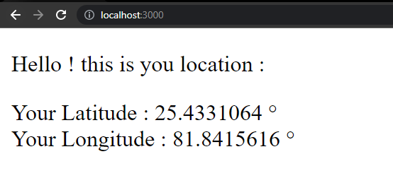
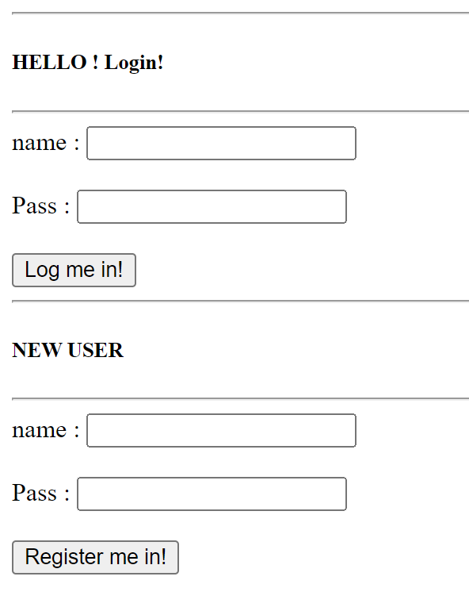

> **Learning Basics**

> * Learned about Package.json (npm init) [it tells which Node packages my project depends on and their versions]
> * installed node (through setup)
> * installed expressJS for setting database (npm i express)
> * installed NEDB for database management (npm i nedb)
> * Made a small webapp that gets client's current latitute and longitude
> * it sends that data to server as a JSON
> * the server sends response to the client as a JSON

> **Login_Auth**
> 
> * Used Node (for running js outside browser)
> * Used Express (for setting up a webserver at any port (here localhost:3000))
> * NEDB for Database (a Node package that stores data into a .db file in json format)
> * Made a small website that has two options - login and register
> 	

>	
>	

> 
> > * If user logs in, the server checks if a matching JSON is in the database (Database/Users.db) 
> > * if it is it returns a JSON with a success message
> > * Else it returns a JSON with fail message
> 
> > * If the user registers the server just adds the data to the database
> > * It doesnt see if it is already present

> **Server_and_Client_Connection**
> * Used Node (for running js outside browser)
> * Used Express (for setting up a webserver at any port (here localhost:3000))
> * NEDB for Database (a Node package that stores data into a .db file in json format)
> * Made a small website where client sends data through a textbox
> * Server recieves data through routing ('/api' route used)
> * Server stores the data into a database.db file locally using NEDB node package