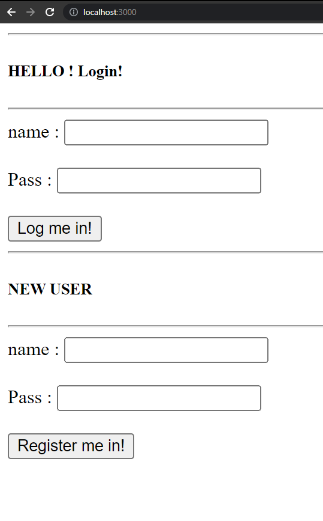

> **lOGIN WITH EMAIL 2**

APIs - 

	1. /register_api
- 	 If Username or Password or Email format is invalid

> 		  verdict 
> 		  { 
>         Status : "Fail"
>         Username_Judgement : "Invalid Username" / "valid Username"
>         Password_Judgement : "Invalid Password" / "Valid Password"
>         Email_Judgement : "Invalid Email" / "Valid Email"
>         }

- 	 If all formats are valid but Username or Email or Both already exists in DB - 

> 		  verdict 
> 		  { 
>         Status : "Fail"
>         Username_Judgement : "Username doesn't exist in DB" / "Username already exist in DB"
>         Password_Judgement : "Valid Password"
>         Email_Judgement : "Email doesn't exist in DB" / "Email already Exists in DB"
>         } 
	
- 	 If Both Username and Email doesnt exist in DB and all(Username/Email/Password) formats are valid - 

> 		  verdict 
> 		  {
>         status : "Success"
>         Username_Judgement : "Username doesn't exist in DB" 
>         Password_Judgement : "Valid Password"
>         Email_Judgement : "Email doesn't exist in DB"
>		  Description : "OTP send Successfully";
>         } 

	2. /validate_OTP

> **Learning Basics**

> * Learned about Package.json (npm init) [it tells which Node packages my project depends on and their versions]
> * installed node (through setup)
> * installed expressJS for setting database (npm i express)
> * installed NEDB for database management (npm i nedb)
> * Made a small webapp that gets client's current latitute and longitude
> * it sends that data to server as a JSON
> * the server sends response to the client as a JSON

> **Login_Auth**
> 
> * Used Node (for running js outside browser)
> * Used Express (for setting up a webserver at any port (here localhost:3000))
> * NEDB for Database (a Node package that stores data into a .db file in json format)
> * Made a small website that has two options - login and register
> 	

>	
>	

> 
> > * If user logs in, the server checks if a matching JSON is in the database (Database/Users.db) 
> > * if it is it returns a JSON with a success message
> > * Else it returns a JSON with fail message
> 
> > * If the user registers the server just adds the data to the database
> > * It doesnt see if it is already present

> **Server_and_Client_Connection**
> * Used Node (for running js outside browser)
> * Used Express (for setting up a webserver at any port (here localhost:3000))
> * NEDB for Database (a Node package that stores data into a .db file in json format)
> * Made a small website where client sends data through a textbox
> * Server recieves data through routing ('/api' route used)
> * Server stores the data into a database.db file locally using NEDB node package

**Single Device Auth**

> How it works?
> 
> > 

> > 
> > 

> > 
> > 

> > 
> > 

> > 
> > 

> > 
> > 
	
> > 